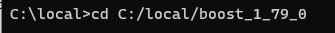
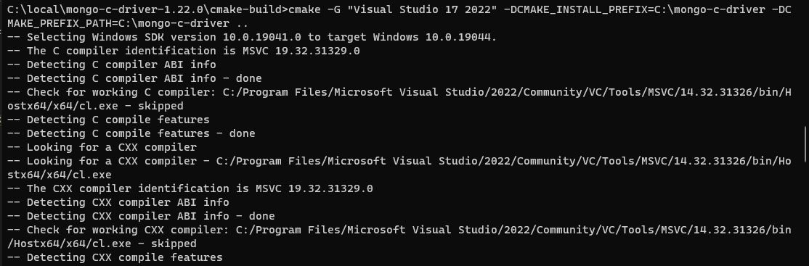
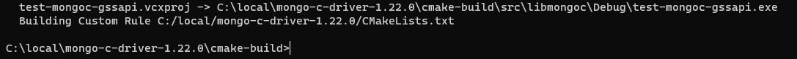

## Running the cli-web_app on your development workspace: (WINDOWS)
cmake --build . --config Release --target web_serv

## Setting up your build environment
In order to configure your environment for build and execution of the server, you must set up your environment by:
downloading building the required dynamic/static libaries

Required libs:
- boost threads
- mongoc driver
- mongocxx driver

PREREQUISITES
1. have CMAKE downloaded (version 3.21 or newer) *YOU MUST INCLUDE AS PATH WHEN DOWNLOADING*
2. have visual studio 2020 downloaded with the desktop development
3. navigate to your "C:" drive
4. create a folder named "local" and *have it as system path environment variable*
5. Have an installation of perl http://strawberryperl.com/
6. Have an installation of nasm https://www.nasm.us
	
BOOST INSTALL:
1. Get the latest driver release from github
	- https://boostorg.jfrog.io/artifactory/main/release/1.79.0/source/boost_1_79_0.zip
2. Unzip it into "C:/local"
3. We need to build the binary for threads despite boost being a mainly header library. Enter such commands in sucession:
	- cd C:/local/boost\<*version*\>\
		
	- bootstrap ./b2
		
		
	- b2 
		
	
MONGOCXX INSTALL:
1. Make sure boost is installed
1. Get the latest driver releases from github
	- c driver: https://github.com/mongodb/mongo-c-driver/releases
	- cxx driver: https://github.com/mongodb/mongo-cxx-driver/releases

2. download .tar.gz release of both drivers
3. once downloaded, unzip the build into the "C:/local" directory. This will require a double unzip. (.tar.gz -> .gz -> required files)
4. open cmd and enter in such commands:
	- cd C:/local/mongo-c-driver-\<version\>\
		
	- mkdir cmake-build\
		
	- cd cmake-build\
		
	- cmake -G "Visual Studio 17 2022" -DCMAKE_INSTALL_PREFIX=C:/local/ -DCMAKE_PREFIX_PATH=C:/local/ .. \
		
		
	- cmake --build .\
		
		
	- cmake --build . --target install\
		
		
	- You should now have a folder called "mongo-c-driver" in your local directory\
	- cd C:/local/mongo-cxx-driver-r3.6.7/build\
		
	- cmake .. -G "Visual Studio 17 2022" -DBOOST_ROOT=C:/local/boost *<your version>* -DCMAKE_PREFIX_PATH=C:/local/ -DCMAKE_INSTALL_PREFIX=C:/local/ \
		
		
	- cmake --build .\
		
		 
		(This is going to take a while)
		
	- cmake --build . --target install\
		
		

## IMPORTARNT!
now since you have a `bin` folder under `C:/local/` you need to set the bin folder as %PATH%
ex: C:/local/bin -> %PATH%

OPENSSL INSTALL:
https://github.com/openssl/openssl/blob/master/NOTES-WINDOWS.md
 1. Install Perl

 2. Install NASM

 3. Make sure both Perl and NASM are on your %PATH%

 4. Use Visual Studio Developer Command Prompt with administrative privileges,
    choosing one of its variants depending on the intended architecture.
    Or run `cmd` and execute `vcvarsall.bat` with one of the options `x86`,
    `x86_amd64`, `x86_arm`, `x86_arm64`, `amd64`, `amd64_x86`, `amd64_arm`,
    or `amd64_arm64`.
    This sets up the environment variables needed for `nmake.exe`, `cl.exe`,
    etc.
    See also
    <https://docs.microsoft.com/cpp/build/building-on-the-command-line>

 5. From the root of the OpenSSL source directory enter
    - `perl Configure VC-WIN32`     if you want 32-bit OpenSSL or
    - `perl Configure VC-WIN64A`    if you want 64-bit OpenSSL or
    - `perl Configure VC-WIN64-ARM` if you want Windows on Arm (win-arm64)
       OpenSSL or
    - `perl Configure`              to let Configure figure out the platform

 6. `nmake`

 7. `nmake test`

 8. `nmake install`